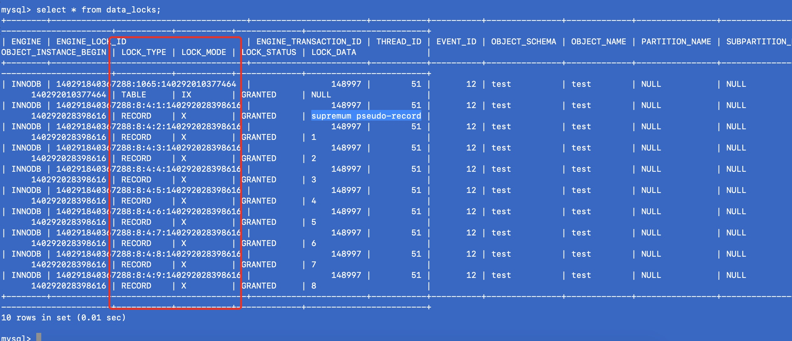

#锁粒度
###1，Record Lock：单个行记录上的锁。

###2，Gap Lock：间隙锁，锁定一个范围，但不包括记录本身。GAP锁的目的，是为了防止同一事务的两次当前读，出现幻读的情况。

###3，Next-Key Lock：1+2，锁定一个范围，并且锁定记录本身。对于行的查询，都是采用该方法，主要目的是解决幻读的问题

###4，表锁

#锁类型
###意向锁I（表级别锁）
####eg:SET autocommit = 0;
       SELECT * FROM  test.test  FOR UPDATE
        可以查看锁的信息
###共享锁S(lock in share mode,lock table read)
###排它锁X(for update,lock table write,update)
###间隙锁GAP
###其他锁如IX, IS

#加锁
####被动：update，delete,alter,serializable隔离级别都会加锁。
####主动：for update,lock in share mode, lock table read|write。X
####for update加锁分析：是意向锁和行锁以及间隙所实现的，supremum pseudo-record 是无穷大的间隙锁

###意向锁的解释

###3、这两中锁定类型的锁共存的问题
###LOCK_DATA 解释：与锁相关的数据（如果有的话）。如果LOCK_TYPE是 RECORD，则值是锁定记录的主键值，否则 NULL。此列包含锁定行中主键列的值，格式为有效的SQL字符串（可以复制到SQL语句）。如果没有主键，LOCK_DATA 则是唯一的InnoDB内部行ID号。
###意向锁解决行锁和表锁的问题

考虑这个例子：

事务A锁住了表中的一行，让这一行只能读，不能写。

之后，事务B申请整个表的写锁。

如果事务B申请成功，那么理论上它就能修改表中的任意一行，这与A持有的行锁是冲突的。

数据库需要避免这种冲突，就是说要让B的申请被阻塞，直到A释放了行锁。

数据库要怎么判断这个冲突呢？

step1：判断表是否已被其他事务用表锁锁表

step2：判断表中的每一行是否已被行锁锁住。

注意step2中通过遍历查询，这样的判断方法效率实在不高，因为需要遍历整个表。

于是就有了意向锁。

在意向锁存在的情况下，事务A必须先申请表的意向共享锁，成功后再申请一行的行锁。

在意向锁存在的情况下，上面的判断可以改成

step1：不变

step2：发现表上有意向共享锁，说明表中有些行被共享行锁锁住了，因此，事务B申请表的写锁会被阻塞。

####mysql在查询字段无索引时使用的是主键索引

####间隙锁之间不是互斥的

###由于InnoDB的索引机制，数据库操作使用了主键索引，InnoDB会锁住主键索引；使用非主键索引时，InnoDB会先锁住非主键索引，再锁定主键索引

###mysql 什么时候使用间隙锁
#####唯一索引命中记录时record锁
#####其他情况使用间隙锁和next lock key

###显示加锁for update 可以解决幻读
